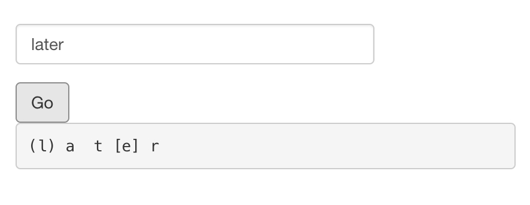
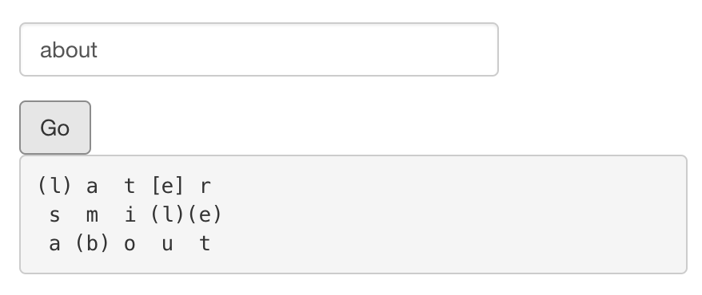
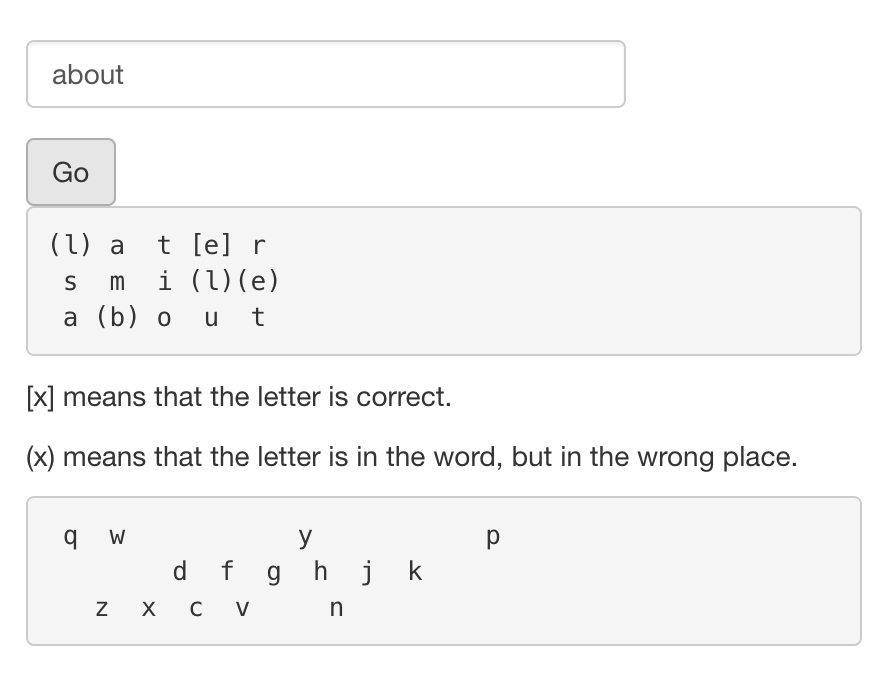

# Shiny Wordle

An implementation of the popular game [Wordle](https://www.powerlanguage.co.uk/wordle/), written in R using [Shiny](https://shiny.rstudio.com/).

Each app file contains a different version of the application, corresponding to each video in the series.

Part 1: [code](app-part1.R), [deployed app](https://winston.shinyapps.io/wordle-part1/)

  

Part 2: [code](app-part2.R), [deployed app](https://winston.shinyapps.io/wordle-part2/)

  

Part 3: [code](app-part3.R), [deployed app](https://winston.shinyapps.io/wordle-part3/)

  

Final version: [code](app-final.R), [deployed app](https://winston.shinyapps.io/wordle/)

  
